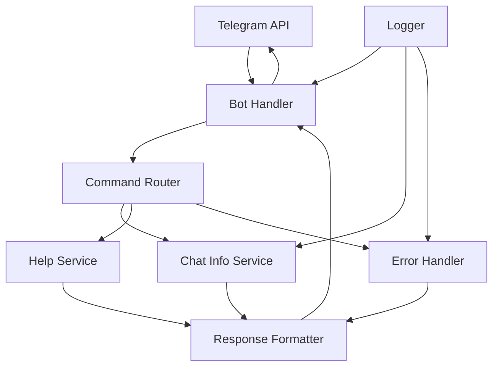

# Design Document

## Overview

这个 Telegram Bot 设计为一个轻量级的工具，专门用于获取 Telegram 群组和聊天的 ID 信息。Bot 将使用 Telegram Bot API 与用户交互，提供简单直观的命令接口来获取聊天信息。

核心设计原则：

- 简单易用：提供直观的命令接口
- 安全可靠：处理各种异常情况和权限问题
- 多环境支持：在群组、私聊、频道中都能正常工作
- 轻量级：最小化依赖和资源使用

## Architecture

### 系统架构图



### 技术栈选择

**编程语言**: Node.js (LTS 版本)

- 原生异步支持，适合 Bot 应用
- 丰富的 npm 生态系统
- 轻量级和高性能
- 易于部署和维护

**开发工具**:

- `nvm`: Node.js 版本管理
- `yarn`: 包管理器，更快更可靠
- `TypeScript`: 类型安全和更好的开发体验

**主要依赖**:

- `telegraf`: 现代化的 Telegram Bot 框架
- `dotenv`: 环境变量管理
- `winston`: 专业的日志记录库
- `@types/node`: TypeScript 类型定义

## Components and Interfaces

### 1. Bot Handler (src/bot/bot-handler.ts)

主要的 Bot 处理器，负责与 Telegram API 的通信。

```typescript
export class TelegramBot {
  constructor(token: string);
  async start(): Promise<void>;
  async stop(): Promise<void>;
  addHandler(handler: any): void;
}
```

### 2. Command Router (src/commands/command-router.ts)

命令路由器，将不同的命令分发到相应的处理器。

```typescript
export class CommandRouter {
  constructor();
  registerCommand(command: string, handler: Function): void;
  async routeCommand(ctx: Context): Promise<void>;
}
```

### 3. Chat Info Service (src/services/chat-info-service.ts)

核心服务，负责获取和格式化聊天信息。

```typescript
export class ChatInfoService {
  async getChatId(ctx: Context): Promise<string>;
  async getChatInfo(ctx: Context): Promise<ChatInfo>;
  formatChatInfo(chatInfo: ChatInfo): string;
}
```

### 4. Help Service (src/services/help-service.ts)

提供帮助信息和使用指南。

```typescript
export class HelpService {
  getHelpMessage(): string;
  getStartMessage(): string;
  getUnknownCommandMessage(): string;
}
```

### 5. Error Handler (src/utils/error-handler.ts)

统一的错误处理和日志记录。

```typescript
export class ErrorHandler {
  constructor(logger: Logger);
  async handleError(ctx: Context, error: Error): Promise<void>;
  logError(error: Error, context: string): void;
}
```

## Data Models

### Chat Information Model

```typescript
export interface ChatInfo {
  chatId: number;
  chatType: "private" | "group" | "supergroup" | "channel";
  title?: string;
  username?: string;
  memberCount?: number;
  description?: string;
}
```

### Bot Configuration Model

```typescript
export interface BotConfig {
  token: string;
  logLevel: string;
  webhookUrl?: string;
  port: number;
}
```

## Error Handling

### 错误分类和处理策略

1. **网络错误**

   - 自动重试机制（指数退避）
   - 记录详细错误日志
   - 用户友好的错误消息

2. **权限错误**

   - 检测 Bot 权限状态
   - 提供权限设置指导
   - 优雅降级处理

3. **API 错误**

   - Token 验证失败处理
   - Rate limiting 处理
   - API 响应格式错误处理

4. **用户输入错误**
   - 未知命令处理
   - 参数验证
   - 帮助信息提示

### 错误恢复机制

```typescript
export class RetryHandler {
  constructor(maxRetries: number = 3, backoffFactor: number = 2.0);
  async retryWithBackoff<T>(func: () => Promise<T>): Promise<T>;
}
```

## Testing Strategy

### 单元测试

- 每个服务组件的独立测试
- Mock Telegram API 响应
- 边界条件和异常情况测试

**测试框架**: Jest + TypeScript

- `jest`: 测试框架
- `@types/jest`: Jest 类型定义
- `ts-jest`: TypeScript 支持

### 集成测试

- Bot 与 Telegram API 的集成测试
- 命令路由和响应测试
- 错误处理流程测试

### 测试环境设置

- 使用 Telegram Bot API 的测试环境
- Mock 数据和响应
- 自动化测试流水线

### 测试覆盖率目标

- 代码覆盖率 > 90%
- 关键路径 100% 覆盖
- 错误处理路径完整测试

## Project Structure

```
telegram-chat-id-bot/
├── src/
│   ├── bot/
│   │   └── bot-handler.ts
│   ├── commands/
│   │   ├── command-router.ts
│   │   ├── chat-id.ts
│   │   ├── chat-info.ts
│   │   └── help.ts
│   ├── services/
│   │   ├── chat-info-service.ts
│   │   └── help-service.ts
│   ├── utils/
│   │   ├── error-handler.ts
│   │   ├── logger.ts
│   │   └── retry-handler.ts
│   ├── types/
│   │   └── index.ts
│   └── index.ts
├── tests/
│   ├── unit/
│   └── integration/
├── .env.example
├── .gitignore
├── .nvmrc
├── package.json
├── tsconfig.json
├── jest.config.js
└── README.md
```

## Deployment and Configuration

### 环境变量配置

```bash
TELEGRAM_BOT_TOKEN=your_bot_token_here
LOG_LEVEL=info
NODE_ENV=production
PORT=3000
```

### 开发环境设置

```bash
# 使用 nvm 管理 Node.js 版本
nvm use

# 使用 yarn 安装依赖
yarn install

# 开发模式运行
yarn dev

# 构建项目
yarn build

# 生产模式运行
yarn start
```

### 部署选项

1. **本地运行**: 适合开发和测试
2. **云服务器**: 适合生产环境
3. **容器化部署**: 使用 Docker 进行部署
4. **Serverless**: 使用 Vercel 或类似服务

### 监控和日志

- 结构化日志记录（Winston）
- 错误率监控
- 响应时间监控
- 用户使用统计
